name: title
layout: true
class: center
---
layout: false
count: false

.middle.center[
# BHD2021 | Building the *NiPreps* community

<br />
<br />

### O. Esteban
#### CHUV | Lausanne University Hospital

###### [oesteban.github.io/bhd2021](https://oesteban.github.io/bhd2021)
]

---
layout: false
count: false

.middle.center[
# BHD2021 | Building the *NiPreps* community

<br />
<br />

### O. Esteban
#### CHUV | Lausanne University Hospital

###### [oesteban.github.io/bhd2021](https://oesteban.github.io/bhd2021)
]

???

I'm going to talk about how we are building a framework of preprocessing pipelines for neuroimaging called NiPreps, based on the fMRIPrep experience.

---
name: newsection
layout: true
class: section-separator

.perma-sidebar[
## BHD2021
# *NiPreps* community

<br />
<br />
<br />
<br />
<br />

<p align="center">

</p>
<br />
<p align="center">
<a rel="license" href="http://creativecommons.org/licenses/by/4.0/"></a>
</p>
]

---
name: sidebar
layout: true

.perma-sidebar[
## BHD2021
# *NiPreps* community

<br />
<br />
<br />
<br />
<br />

<p align="center">

</p>
<br />
<p align="center">
<a rel="license" href="http://creativecommons.org/licenses/by/4.0/"></a>
</p>
]

---
template: sidebar

## Outlook

.left-column3[
.distribute.large[
- How communities form

- The *fMRIPrep* experience

- From *fMRIPrep* to *NiPreps*

- Governance and GitHub's MVG

- Community tools (on GitHub)

- Beyond the defaults
]
]

.right-column3[
<p align="center">
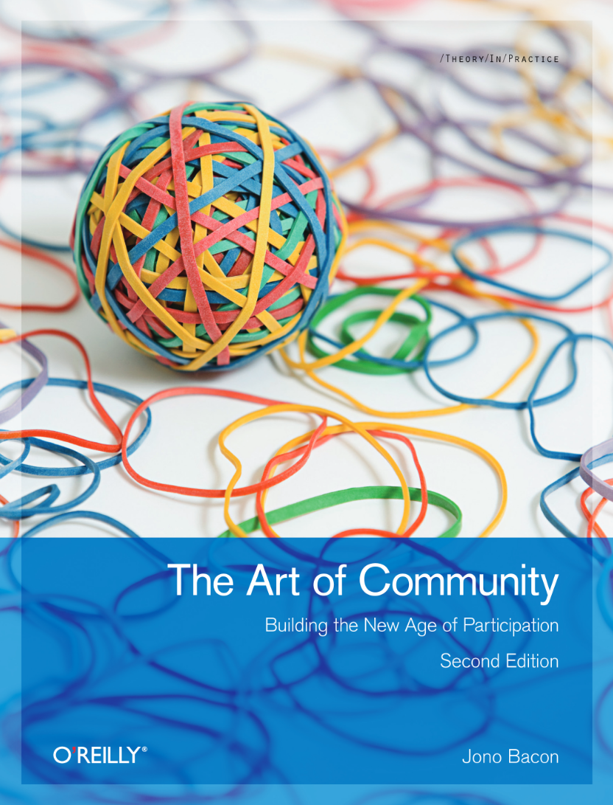
</p>
https://www.jonobacon.com/books/artofcommunity/
]

---

## Open-Science as an ethos
<br />

<div style="margin: 10px 100px 10px 300px">
<p align="center">
  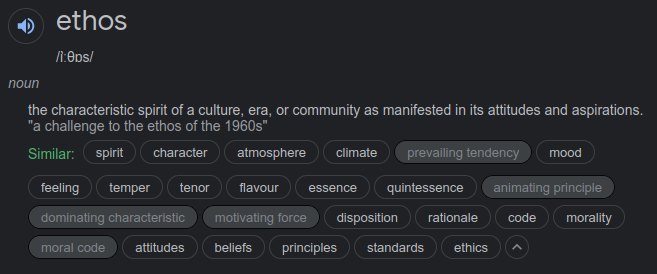
</p>
</div>

---

## Jono Bacon's *Community TODO List*

.larger[
☑ Identify how we can divide our community into teams.

☑ Ensure that teams can communicate early and effectively.

☑ Attract a diverse range of contributors to our community to get involved and contribute to our goals.

☑ Build an environment conducive to our wider goals.

☑ Define the scope of each team, and help team members understand that scope.

☑ Understand the extent and range of collaboration between our teams.

☑ Encourage diversity and opportunity in the community.

☑ Produce a Code of Conduct.

]

---

## The *fMRIPrep* story

### fMRIPrep produces analysis-ready data from diverse data
* minimal requirements ([BIDS-compliant](https://bids-standard.github.io/bids-validator/));
* *agnostic* to downstream steps of the workflow
  * produces [BIDS-Derivatives](https://bids-specification.readthedocs.io/en/derivatives/05-derivatives/01-introduction.html);
* robust against inhomogeneity of data across studies

???

fMRIPrep takes in a task-based or resting-state
functional MRI dataset in BIDS-format
and returns preprocessed data ready for analysis.

Preprocessed data can be used for a broad range of analysis, and they are
formatted following BIDS-Derivatives to maximize compatibility with:
  * major software packages (AFNI, FSL, SPM\*, etc.)
  * further temporal filtering and denoising: *fMRIDenoise*
  * any BIDS-Derivatives compliant tool (e.g., *FitLins*).

--

### fMRIPrep is a [BIDS-App](https://bids-apps.github.io) ([Gorgolewski, et al. 2017](https://doi.org/10.1371/journal.pcbi.1005209))
* adhered to modern software-engineering standards (CI/CD, containers)
* compatible interface with other BIDS-Apps
* optimized for automatic execution

???

fMRIPrep adopts the BIDS-App specifications.
That means the software is tested with every change to the codebase,
it also means that packaging, containerization, and deployment are also
automated and require tests to be passing.
BIDS-Apps are inter-operable (via BIDS-Derivatives),
and optimized for execution in HPC, Cloud, etc.

--

### Minimizes human intervention
* avoid error-prone parameters settings (read them from BIDS)
* adapts the workflow to the actual data available
  * while remaining flexible to some design choices (e.g., whether or not reconstructing surfaces or customizing target normalized standard spaces)

???

fMRIPrep minimizes human intervention because the user does not
need to fiddle with any parameters - they are obtained from the BIDS structure.
However, fMRIPrep does allow some flexibility to ensure the preprocessing meets the requirements of the intended analyses.

---

### *fMRIPrep* was not originally envisioned as a community project ...

(we just wanted a robust tool to automatically preprocess incoming data of OpenNeuro.org)

--


### ... but a community built up quickly around it

<br />

--

.pull-left[
## Key aspects

* Preprocessing of fMRI was in need for **division of labor**.

* Obsession with **transparency**.

* **Responsiveness** to feedback.

* **Due credit**
]

.pull-right[
<p align="center">
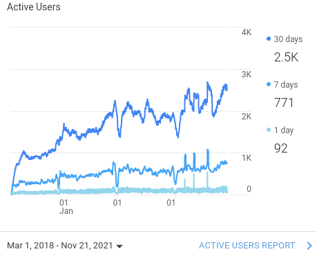
</p>
]


???

Preprocessing is a time-consuming effort, requires expertise converging imaging foundations & CS, typically addressed with legacy *in-house* pipelines.

On the right-hand side, you'll find the chart of unique visitors
to fmriprep.org, which is the documentation website.

---

## Key aspect: division of labor

<div style="margin: 40px 100px 10px 320px">
<p align="center">
  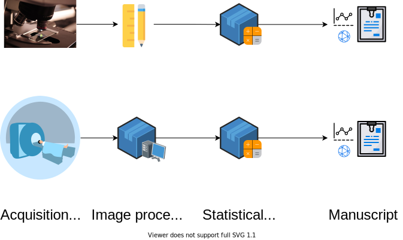
</p>
</div>


---

## Key aspect: transparency
.pull-left[
<p align="center">

</p>
]

.pull-right[

.distribute[
fMRIPrep generates one participant-wide report after execution.

Reports describe the data as found, and the steps applied
(providing .blue[visual support to look inside the box]):

  1. show researchers their data;

  2. show how *fMRIPrep* interpreted the data (describing the actual preprocessing steps);

  3. quality control of results, facilitating early error detection.
]
]

???

Therefore, reports have become a fundamental feature of fMRIPrep
because they not only allow assessing the quality of the processing,
but also provide an insight about the logic supporting such processing.

In other words, reports help respond to the what was done and the why was it done
in addition to the how well it did.

---

## Key aspect: responsiveness (www.neurostars.org)

https://neurostars.org/tag/fmriprep

<div style="margin: 40px 100px 10px 320px">
<p align="center">
  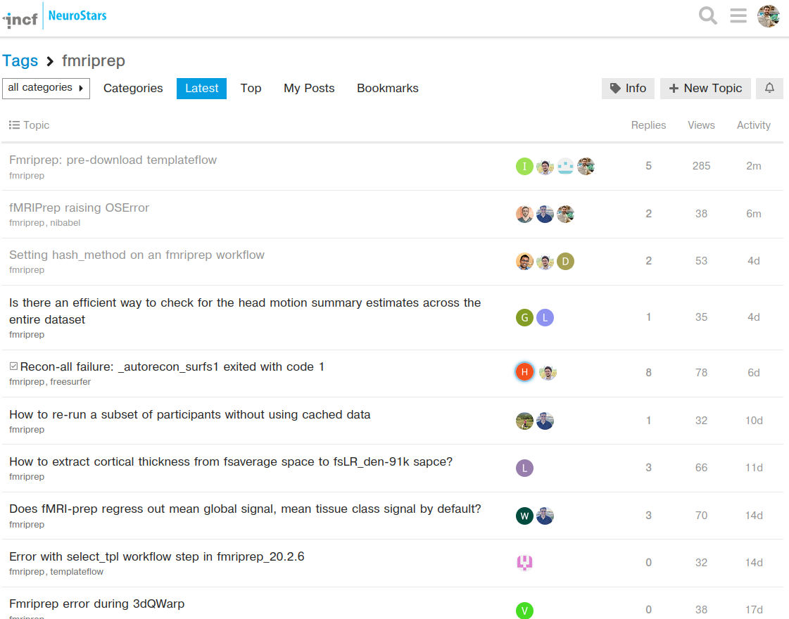
</p>
</div>

---

## Key aspect: credit all direct contributors

```Shell
oesteban@dendrite:~/workspace/fmriprep$ python .maint/paper_author_list.py
```

.small[
```
Running '/usr/local/bin/git-line-summary' on repo
Some people made commits, but are missing in .maint/ files: Theo Schäfer, cprovins, Soichi Hayashi, Zeynep Enkavi, Ilkay Isik, Jarod Roland, Ali Cohen, Jakub Kaczmarzyk, Marc Bue, Marcel Falkiewicz, Matteo Visconti di Oleggio Castello, Michael Joseph, Saren Seeley, Sebastien Naze, The Gitter Badger.
Authors (53):
Markiewicz, Christopher J. \ :sup:`1`\ ; Blair, Ross W. \ :sup:`1`\ ; Goncalves, Mathias \ :sup:`1`\ ; Kent, James D. \ :sup:`2`\ ; DuPre, Elizabeth \ :sup:`3`\ ; Salo, Taylor \ :sup:`4`\ ; Ciric, Rastko \ :sup:`1`\ ; Pinsard, Basile \ :sup:`5`\ ; Heinsfeld, Anibal S. \ :sup:`6`\ ; Benson, Noah C. \ :sup:`7`\ ; de la Vega, Alejandro \ :sup:`8`\ ; Feingold, Franklin \ :sup:`1`\ ; Valabregue, Romain \ :sup:`9`\ ; Sneve, Markus H. \ :sup:`10`\ ; Finc, Karolina \ :sup:`11`\ ; Erramuzpe, Asier \ :sup:`12`\ ; Moodie, Craig A. \ :sup:`1`\ ; Mentch, Jeff \ :sup:`13`\ ; Jacoby, Nir \ :sup:`14`\ ; Lurie, Daniel J. \ :sup:`15`\ ; Ye, Zhifang \ :sup:`16`\ ; Frederick, Blaise B. \ :sup:`17, 18`\ ; Ma, Feilong \ :sup:`19`\ ; Tooley, Ursula A. \ :sup:`20`\ ; Liem, Franz \ :sup:`21`\ ; Halchenko, Yaroslav O. \ :sup:`19`\ ; Adebimpe, Azeez \ :sup:`22`\ ; Rivera-Dompenciel, Adriana \ :sup:`2`\ ; Amlien, Inge K. \ :sup:`10`\ ; Wexler, Joseph B. \ :sup:`1`\ ; Waller, Lea \ :sup:`23`\ ; Thompson, William H. \ :sup:`1`\ ; Nitsch, Alexander \ :sup:`24`\ ; Stojić, Hrvoje \ :sup:`25`\ ; Groen, Iris I. A. \ :sup:`26`\ ; Jamison, Keith W. \ :sup:`27`\ ; Sitek, Kevin R. \ :sup:`13`\ ; Urchs, Sebastian \ :sup:`3`\ ; Gomez, Daniel E. P. \ :sup:`28`\ ; Devenyi, Grabriel A. \ :sup:`29`\ ; Naveau, Mikaël \ :sup:`30`\ ; Velasco, Pablo \ :sup:`31`\ ; Bellec, Pierre \ :sup:`5`\ ; Cieslak, Matthew \ :sup:`22`\ ; Ghosh, Satrajit S. \ :sup:`32, 33`\ ; Isik, Ayse Ilkay \ :sup:`34`\ ; Provins, Céline \ :sup:`35`\ ; Satterthwaite, Theodore D. \ :sup:`22`\ ; Schaefer, Theo A.J. \ :sup:`24`\ ; Wright, Jessey \ :sup:`1`\ ; Gorgolewski, Krzysztof J. \ :sup:`1`\ ; Poldrack, Russell A. \ :sup:`1`\ ; Esteban, Oscar \ :sup:`36`\ .


Affiliations:
 1. Department of Psychology, Stanford University
 2. Neuroscience Program, University of Iowa
 3. Montreal Neurological Institute, McGill University
 4. Department of Psychology, Florida International University
 5. SIMEXP Lab, CRIUGM, University of Montréal, Montréal, Canada
 6. Child Mind Institute
 7. Department of Psychology, New York University
 8. University of Texas at Austin
 9. CENIR, INSERM U1127, CNRS UMR 7225, UPMC Univ Paris 06 UMR S 1127, Institut du Cerveau et de la Moelle épinière, ICM, F-75013, Paris, France
10. Center for Lifespan Changes in Brain and Cognition, University of Oslo
11. Centre for Modern Interdisciplinary Technologies, Nicolaus Copernicus University in Toruń
12. Computational Neuroimaging Lab, BioCruces Health Research Institute
13. Speech & Hearing Bioscience & Technology Program, Harvard University
14. Department of Psychology, Columbia University
15. Department of Psychology, University of California, Berkeley
16. State Key Laboratory of Cognitive Neuroscience and Learning, Beijing Normal University
17. McLean Hospital Brain Imaging Center, MA, USA
18. Consolidated Department of Psychiatry, Harvard Medical School, MA, USA
19. Dartmouth College: Hanover, NH, United States
20. Department of Neuroscience, University of Pennsylvania, PA, USA
```
]

--

## .. and indirect: *citation boilerplate*.

---


### Researchers want to spend more time on those areas most relevant to them
(probably not preprocessing...)

???

With the development of fMRIPrep we understood that
researchers don't want to waste their time on preprocessing
(except for researchers developing new preprocessing techniques).

--

### Writing *fMRIPrep* required a team of several experts in processing methods for neuroimaging, with a solid base on Computer Science.
(research programs just can't cover the neuroscience and the engineering of the whole workflow - we need to divide the labor)

???

The current neuroimaging workflow requires extensive knowledge in
sometimes orthogonal fields such as neuroscience and computer science.
Dividing the labor in labs, communities or individuals with the necessary
expertise is the fundamental for the advance of the whole field.

--

### Transparency helps against the risk of super-easy tools
(easy-to-use tools are risky because they might get a researcher very far with no idea whatsoever of what they've done)

???

There is an implicit risk in making things too easy to operate:

For instance, imagine someone who runs fMRIPrep on diffusion data by
tricking the BIDS naming into an apparently functional MRI dataset.
If fMRIPrep reached the end at all, the garbage at the output could be fed into
further tools, in a sort of a snowballing problem.

When researchers have access to the guts of the software and are given an opportunity to understand what's going on, the risk of misuse dips.

--

### Established toolboxes do not have incentives for compatibility
(and to some extent this is not necessarily bad, as long as they are kept well-tested and they embrace/help-develop some minimal standards)

???

AFNI, ANTs, FSL, FreeSurfer, SPM, etc. have comprehensive software validation tests,
methodological validation tests, stress tests, etc. - which pushed up their quality and made them fundamental for the field.

Therefore, it is better to keep things that way (although some minimal efforts towards convergence in compatibility are of course welcome)

---

<div style="margin: 40px 100px 10px 320px">
<p align="center">
  
</p>
<p align="right">
(<a href="https://doi.org/10.1038/s41592-018-0235-4">Esteban et al., 2019</a>)
</p>
</div>

---

<div style="margin: 40px 100px 10px 320px">
<p align="center">
  
</p>
<p align="right">
(today)
</p>
</div>

---

template: newsection
layout: false

.middle.center[
# www.nipreps.org

### (*NiPreps* == NeuroImaging PREProcessing toolS)

]

???

The enormous success of fMRIPrep led us to propose
its generalization to other MRI and non-MRI modalities,
as well as nonhuman species (for instance, rodents),
and particular populations currently unsupported by fMRIPrep
such as infants.

---

## Augmenting scanners to produce "*analysis-grade*" data

<div style="margin: 40px 100px 10px 320px">
<p align="center">
  
</p>
</div>

--

.pull-left[
***Analysis-grade* data** is an analogy to the concept of "*sushi-grade (or [sashimi-grade](https://en.wikipedia.org/wiki/Sashimi)) fish*" in that both are:
]

--

.pull-right[
.large[**minimally preprocessed**,]

and

.large[**safe to consume** directly.]
]


---

<div align="center" style='margin-top: 1em'>

</div>

???

The processing elements extracted from fMRIPrep can be mapped to three
regimes of responsibility:

- Software infrastructure composed by tools ensuring the collaboration and the most basic tooling.
- Middleware utilities, which build more advanced tooling based on the foundational infrastructure
- And at the top of the stack end-user applications - namely fMRIPrep, dMRIPrep, sMRIPrep and MRIQC.

As we can see, the boundaries of these three architectural layers are soft and tools such as TemplateFlow may stand in between.

Only projects enclosed in the brain shape pertain to the NiPreps community. NiPype, NiBabel and BIDS are so deeply embedded as dependencies that NiPreps can't be understood without them.

---

## Outlook

.left-column3[
.distribute.large[
- How communities form

- The *fMRIPrep* experience

- From *fMRIPrep* to *NiPreps*

- Governance and GitHub's MVG

- Community tools (on GitHub)

- Beyond the defaults
]
]

---

## MVG - Minimum Viable Governance

<div style="margin: 40px 100px 10px 320px">
<a href="https://github.com/github/MVG">github/MVG</a>
<p align="center">
  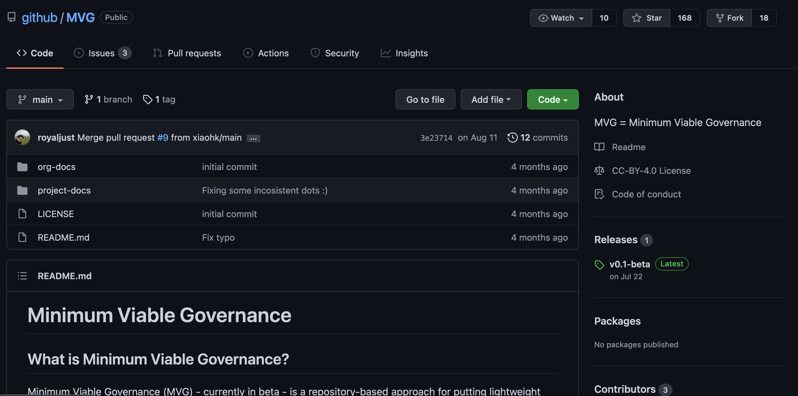
</p>
</div>

---

## [nipreps/GOVERNANCE](https://github.com/nipreps/GOVERNANCE) is a fork of GitHub's MVG

.left-column[
  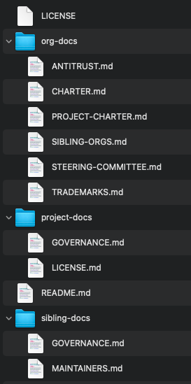
]

.right-column[
* three-tier structure
    * organization level
    * project level
    * sibling project level

* Organization level:
    * Technical Steering Committee
    * Shared community documents:
        * Code of Conduct
        * Support
        * Licensing policy

* Project & Siblings
    * Consensus-based
    * Crediting system (under `.maint/`)
]

---

## Governance - establishing transparent communication

<div style="margin: 40px 100px 10px 320px">
<a href="https://nipy.discourse.group/c/nipreps/9">Nipy Discourse / NiPreps Category</a>
<p align="center">
  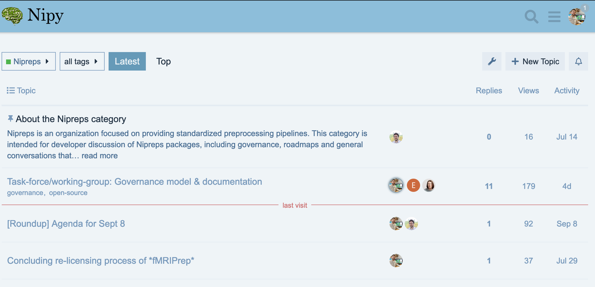
</p>
</div>

---

## Special `.github` repo ([nipreps/.github](https://github.com/nipreps/.github))


<div style="margin: 40px 90px 10px 310px">
Defines organization-wide documents / CODE OF CONDUCT
<p align="center">
  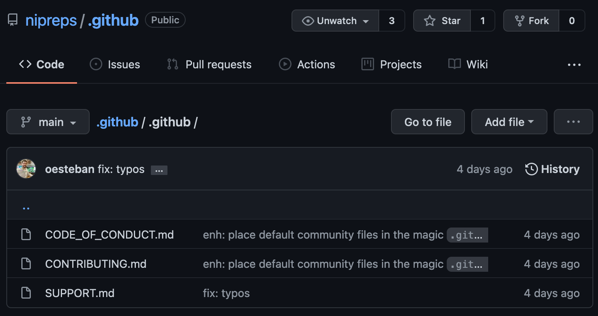
</p>
</div>

---

## Community tools

<div style="margin: 40px 100px 10px 320px">
<a href="https://docs.github.com/en/communities">https://docs.github.com/en/communities</a>
<p align="center">
  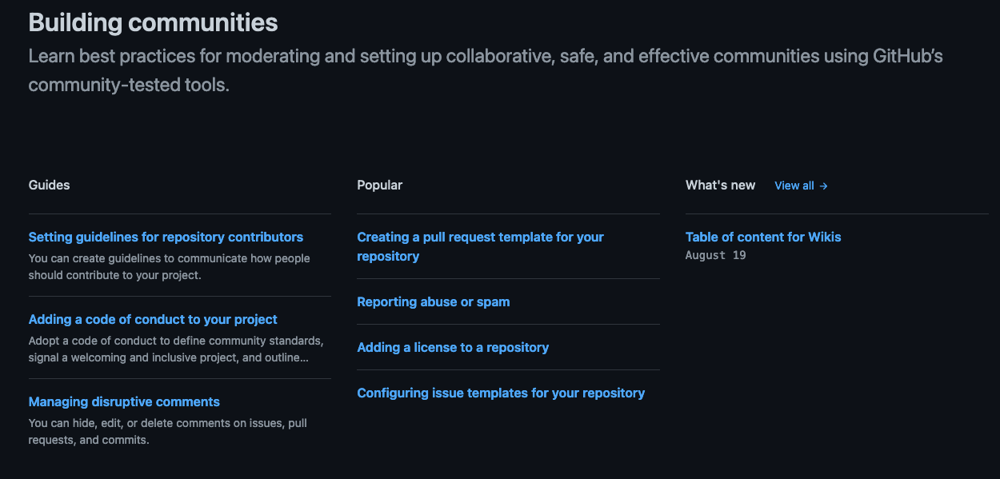
</p>
</div>

---

## Outlook

.left-column3[
.distribute.large[
- How communities form

- The *fMRIPrep* experience

- From *fMRIPrep* to *NiPreps*

- Governance and GitHub's MVG

- Community tools (on GitHub)

- Beyond the defaults
]
]

---

## Beyond the defaults

* Lowering entry barriers (diversity and opportunity):
    * Definition of contribution / the `CONTRIBUTING.md` file
    * [Issue labels](https://www.nipreps.org/community/CONTRIBUTING/#issue-labels) (e.g., )


* Setting clear expectations for contributors:
    * Automated tests / CI
    * Level of documentation required


* Creating a welcoming environment:
    * Welcome bot
    * Other automations (e.g., GitHub Actions)
    * Crediting system

<div style="margin: 40px 100px 10px 320px">
<p align="center">
  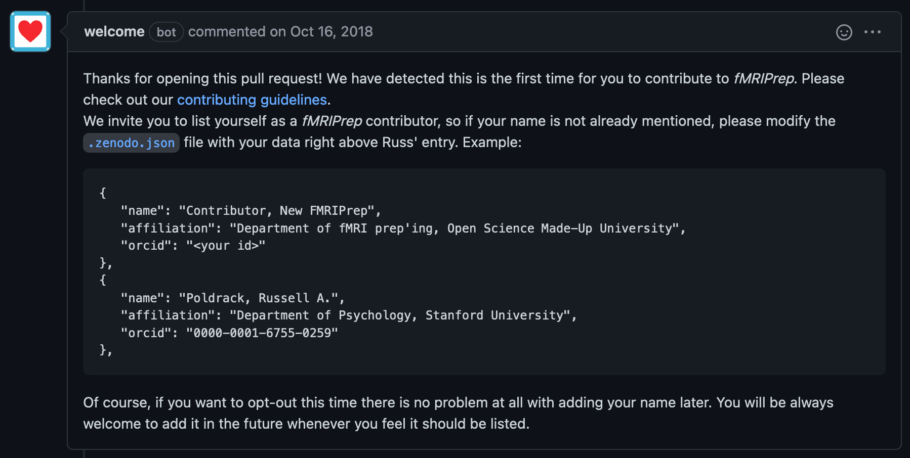
</p>
</div>


---

## Jono Bacon's *Community TODO List*

.larger[
☑ Identify how we can divide our community into teams.

☑ Ensure that teams can communicate early and effectively.

☑ Attract a diverse range of contributors to our community to get involved and contribute to our goals.

☑ Build an environment conducive to our wider goals.

☑ Define the scope of each team, and help team members understand that scope.

☑ Understand the extent and range of collaboration between our teams.

☑ Encourage diversity and opportunity in the community.

☑ Produce a Code of Conduct.

]

---

# Thanks

.dark[


]

---

template: newsection
layout: false

.middle.center[

# Where to start?

## [www.nipreps.org](https://www.nipreps.org/)
## [github.com/nipreps](https://github.com/nipreps/)
]

---

template: newsection
layout: false

.middle.center[
# Thanks!

## Questions?
]
